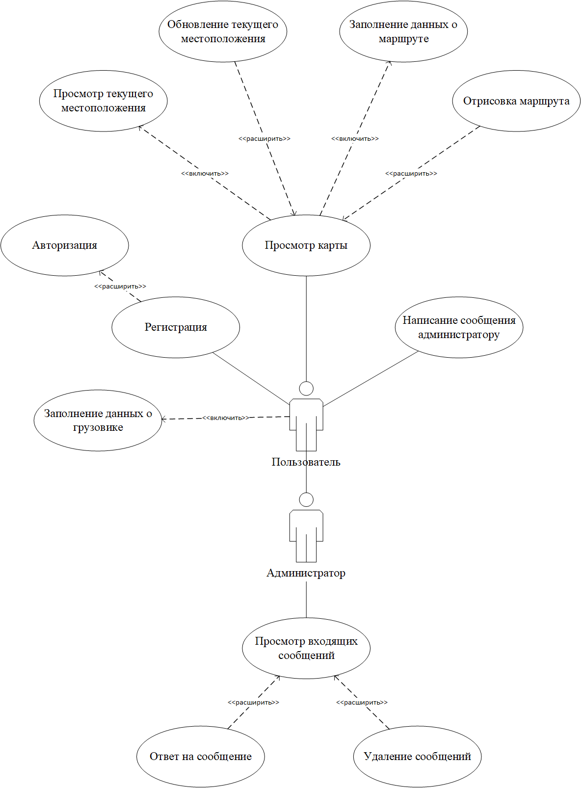
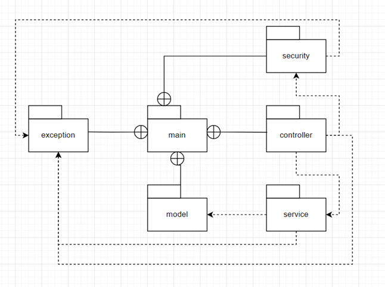
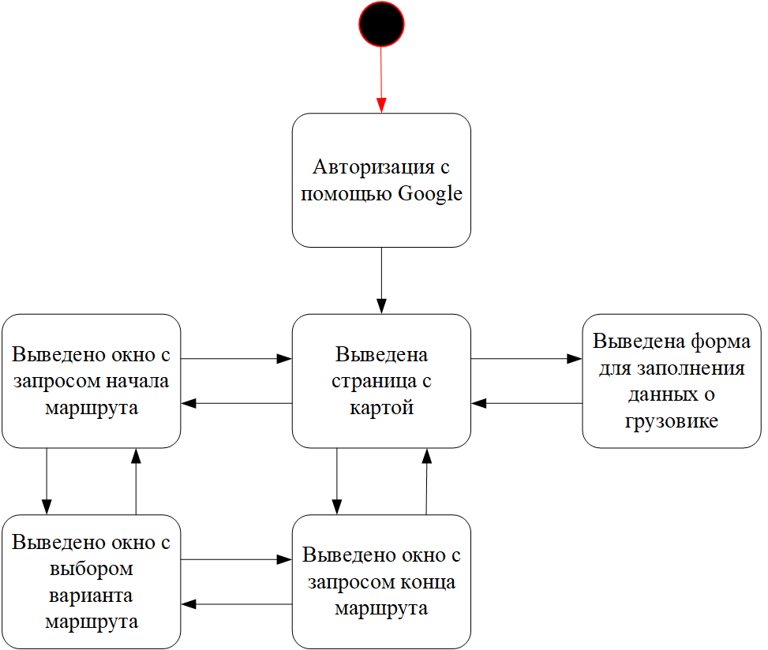
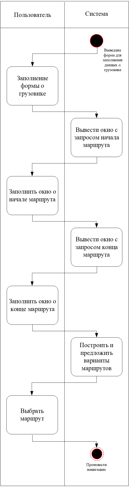
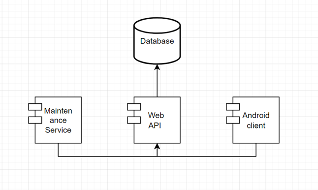

# Построение UML диаграммы
Функциональную модель предметной области представлена в виде диаграммы вариантов использования в нотации UML, представляющей систему в виде набора варианта использования и актеров, взаимодействующих с ними. В рамках предметной области можно выделить двух актеров: администратор и пользователь.

# Построение диаграммы классов
Все классы логически можно разделить на 6 пакетов: 
- main – пакет, содержащий все классы приложения. 
- exception – пакет, содержащий классы исключений. 
- model – пакет, содержащий классы доменных моделей. 
- service – пакет, содержащий классы с бизнес-логикой. 
- controller – пакет, содержащий классы для обработки запросов к веб-сервису. 
- security – пакет, содержащий классы с логикой, касающейся безопасности веб-сервиса.

# Диаграмма состояний
После запуска приложения система принимает состояние “Авторизация с помощью Google”, после чего отображает страницу с картой. 
Дальнейшие состояния зависят от функции или операции, выбранной пользователем. 

Если пользователь выбрал ввести данные о грузовике, будет выведена форма для введения данных о грузовике. 

Если пользователь выбрал функцию ввести точку начала маршрута, будет выведена форма для введения начала маршрута. 

Если пользователь выбрал функцию ввести точку конца маршрута, будет выведена форма для введения конца маршрута. 

Если пользователь ввёл все необходимые данные, будет построено несколько вариантов маршрутов, и пользователь сможет выбрать один из них. 

# Диаграмма активностей

Активность предполагает состояние “Форма для заполнения данных о грузовике” и включает следующие действия: 
- Пользователь заполняет форму о грузовике 
- Система выводит окно для ввода начала маршрута 
- Пользователь вводит начало маршрута
- Система выводит окно для ввода конца маршрута  
- Пользователь вводит конец маршрута
- Система строит предлагает варианты маршрутов 
- Пользователь выбирает маршрут
- Система начинает следование маршруту

# Диаграмма компонентов системы

На этапе разработки система включает следующие компоненты: 
- Database – компонент базы данных. 
- Web API – компонент веб-сервиса, содержит всю core бизнес-логику системы. 
- Android client – компонент клиентского приложения для ОС Android, общается с компонентом Web API посредством HTTP-запросов. 
- Maintenance service – компонент сервиса технического обслуживания, общается в компонентом Web API посредством HTTP-запросов.

